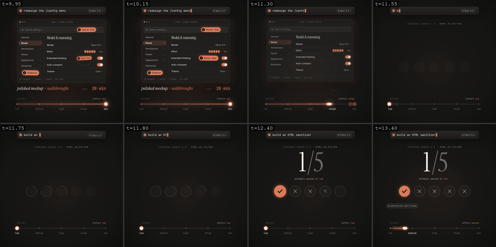
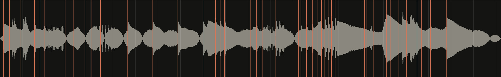

# claude-motion

**Remotion skills teach Claude the API. This repo teaches it taste.**

<p align="center">
  
</p>

<!-- For the version with sound: open this README in the GitHub editor, drag out/effort.mp4 in, and GitHub will turn it into an inline player. -->

The video above was made by Claude from one prompt: *"make a dynamic 15-second motion graphics video that shows what an incredible motion designer you are"*, plus one revision. No After Effects, no timeline editor, no stock sounds. [How it was made →](examples/01-effort/)

## What's inside

- **Motion design rules with numbers.** Easing curves, spring presets, stagger, reading holds, type scale, one-accent color, texture, motivated transitions. Not "make it smooth": `bezier(0.16, 1, 0.3, 1)` for entrances, exits at half the duration, 0.09 s word stagger.
- **A visual self-review loop.** Claude renders a draft, builds contact sheets at every beat, looks at them, checks a list (collisions, clipping, holds, safe area, phone readability) and fixes what it finds before telling you it's done.
- **Sound design synced to every cut.** One `timeline.json` drives both picture and audio. All sound is procedural (no samples, no licensing), mastered to −14 LUFS, with a waveform check that shows every hit landing on its beat.
- **A finished reference piece** with reusable components: masked text reveals, rolling numbers, prompt bar with typing, a spring-loaded slider, film grain, hand-drawn line boil.

Works with Claude Code and Cursor out of the box (skills in `.claude/skills/`), and with Codex / OpenCode / anything that reads `AGENTS.md`.

## Quick start

**Let your agent do it.** Paste this into Claude Code, Cursor, Codex or OpenCode:

```text
Clone https://github.com/YOUR_USERNAME/claude-motion and cd into it.
Check that Node 20+, Python 3 and ffmpeg are installed; install whatever is missing.
Run `npm install` and `npm run build`, then show me out/effort.mp4.
Then read AGENTS.md and the skills in .claude/skills/, and ask me what video I want to make next.
```

**Or by hand:**

```bash
git clone https://github.com/YOUR_USERNAME/claude-motion && cd claude-motion
npm install
npm run build        # → out/effort.mp4
npm run studio       # live preview
```

Then ask your agent for a video. It will pick up the skills on its own.

## The pipeline

```
 idea ─► timeline.json ─┬─► React scenes ─► npm run draft ─► npm run sheet ─► look, fix ─┐
        (every beat)    │                                                                │
                        │                        ◄─────────────── repeat ────────────────┘
                        └─► scripts/sfx.py ─► npm run wave (sync + loudness)
                                                   │
                                     npm run build ─► out/effort.mp4
```

| Command | |
|---|---|
| `npm run studio` | live preview |
| `npm run draft` | fast half-res render |
| `npm run sheet` | contact sheets at every beat (`-- --from 3 --to 5 --every 0.2` to scrub a transition) |
| `npm run sfx` | regenerate sound from the timeline |
| `npm run wave` | waveform with beat markers + LUFS / true peak |
| `npm run build` | final render with sound |
| `npm run gif` | README preview |
| `npm run cover` | 5:2 cover for an X Article, drawn from the same timeline |

<p align="center">
  <br/>
  <sub>What Claude looks at: one tile per beat, labelled with its timestamp.</sub>
</p>

<p align="center">
  <br/>
  <sub>Sound check: every coral line is a beat from timeline.json.</sub>
</p>

## Effort levels for motion work

What I use with Opus 5.5 (`/effort` in Claude Code):

| Stage | Effort | Why |
|---|---|---|
| Storyboard, message, hook | `low` | fast back-and-forth, you're in the loop |
| Building scenes | `medium` | the default, good enough for most component work |
| Review loop, retiming, final polish | `high` | this is where checking every frame pays off |
| "Make the whole thing, I'm going for coffee" | `xhigh` / `max` | autonomous end to end, slower and pricier |

## Optional MCP servers

Nothing here needs MCP. These add real capabilities; copy `.mcp.json.example` to `.mcp.json` and keep what you want.

| Server | Adds |
|---|---|
| [`@remotion/mcp`](https://www.remotion.dev/docs/ai/mcp) | searchable Remotion docs, fewer API hallucinations |
| [ElevenLabs](https://github.com/elevenlabs/elevenlabs-mcp) | voiceover and sounds you can't synthesize |
| [Playwright](https://github.com/microsoft/playwright-mcp) | screenshots of a real product UI to animate |
| [Figma](https://help.figma.com/hc/en-us/articles/32132100833559) | pull frames and design tokens straight from your file |

Pair it with the official [Remotion agent skills](https://www.remotion.dev/docs/ai/skills) for API coverage; this repo is about the design layer on top.

## Gallery

| | |
|---|---|
| [**01 · Spending your effort**](examples/01-effort/) | Claude Code `/effort` explained. 22 s, one prompt + one revision. |
| *yours?* | [Add it →](CONTRIBUTING.md) |

## Requirements

Node 20+, Python 3, ffmpeg. A system Chromium at `/usr/bin/chromium` (or `$REMOTION_BROWSER`) is used if present; otherwise Remotion downloads one on first render.

## License

Code in this repo: [MIT](LICENSE). Remotion itself has its own license: free for individuals and small teams, companies above the threshold need a [company license](https://www.remotion.dev/license).
